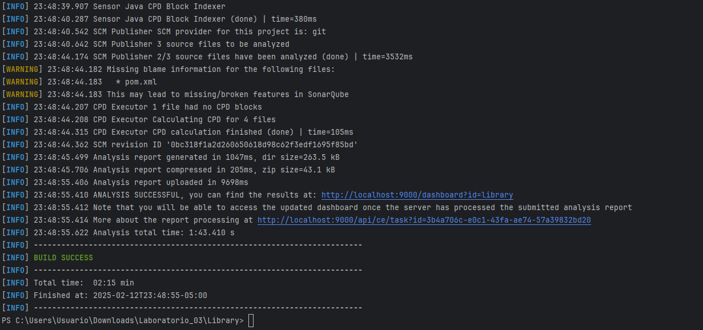

# Laboratorio 03

## Informe estático Sonarqube

### Luego de configurar el proyecto con Sonarqube, ejecutamos el comando: mvn verify sonar:sonar

### Ahora debemos ir a la página de SonarQube donde iniciamos sesión, verificamos que se halla generado el informe

